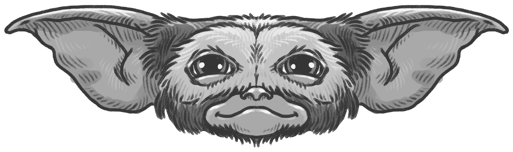
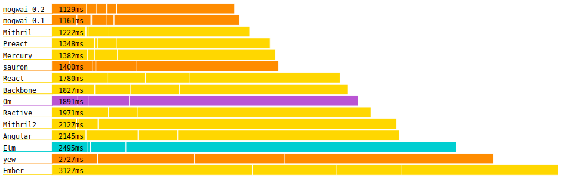

<div align="center">
  <h1>
    <a href="https://bomtoons.newgrounds.com/" target="_blank" title="art by bomtoons at newgrounds">
      
    </a>
    <br />
    mogwai
  </h1>
</div>


> **m**inimalist, **o**bvious, **g**raphical **w**eb **a**pplication **i**nterface


release: [![Crates.io][ci]][cl] 

master: 

[ci]: https://img.shields.io/crates/v/mogwai.svg
[cl]: https://crates.io/crates/mogwai/


`mogwai` is a frontend DOM library for creating web applications.
It is written in Rust and runs in your browser. It is an alternative
to React, Backbone, Ember, Elm, Purescript, etc.

## goals

* provide a declarative approach to creating and managing DOM nodes
* encapsulate component state and compose components easily
* explicate DOM updates
* be small and fast (snappy af)

If mogwai achieves these goals, which I think it does, then maintaining
application state, composing widgets and reasoning about your program will be
easy. Furthermore, your users will be happy because their UI is snappy!

## example
Here is an example of a button that counts its own clicks.

```rust, no_run
extern crate mogwai;
use mogwai::prelude::*;

let (tx, rx) =
  txrx_fold(
    0,
    |n:&mut i32, _:&Event| -> String {
      *n += 1;
      if *n == 1 {
        "Clicked 1 time".to_string()
      } else {
        format!("Clicked {} times", *n)
      }
    }
  );

view!(
    <button on:click=tx>
        {("Clicked 0 times", rx)}
    </button>
).run().unwrap_throw()
```

Here's that same example using the elm-like `Component` trait:

```rust
use mogwai::prelude::*;

pub struct Button {
    pub clicks: i32
}

#[derive(Clone)]
pub enum ButtonIn {
    Click
}

#[derive(Clone)]
pub enum ButtonOut {
    Clicks(i32)
}

impl Component for Button {
    type ModelMsg = ButtonIn;
    type ViewMsg = ButtonOut;
    type DomNode = HtmlElement;

    fn update(
        &mut self,
        msg: &ButtonIn,
        tx_view: &Transmitter<ButtonOut>,
        _subscriber: &Subscriber<ButtonIn>
    ) {
        match msg {
            ButtonIn::Click => {
                self.clicks += 1;
                tx_view.send(&ButtonOut::Clicks(self.clicks))
            }
        }
    }

    fn view(
        &self,
        tx: &Transmitter<ButtonIn>,
        rx: &Receiver<ButtonOut>
    ) -> View<HtmlElement> {
        let rx_text = rx.branch_map(|msg| match msg {
            ButtonOut::Clicks(n) => format!("Clicked {} times", n)
        });
        let tx_event = tx.contra_map(|_:&Event| ButtonIn::Click);

        view!(
            <button on:click=tx_event>
                {("Clicked 0 times", rx_text)}
            </button>
        )
    }
}

let mut gizmo = Button{ clicks: 0 }.into_gizmo();

// Pass some messages in to update the view, as if the button had been
// clicked.
gizmo.update(&ButtonIn::Click);
gizmo.update(&ButtonIn::Click);

assert_eq!(&gizmo.view_ref().clone().into_html_string(), "<button>Clicked 2 times</button>");

if cfg!(target_arch = "wasm32") {
    // running a gizmo or a view only works in the browser, as ownership
    // of is passed to the window
    gizmo.run().unwrap_throw()
}
```

## introduction
If you're interested in learning more - please read the [introduction and
documentation](https://docs.rs/mogwai/).

## why
Rust is beginning to have a good number of frontend libraries. Most however,
encorporate a virtual DOM with a magical update phase. Even in a languague that
has performance to spare this step can cause unwanted slowness.

`mogwai` lives in a happy space just above "bare metal". It does this by
providing the tools needed to declare exactly which parts of the DOM change and
when.

These same tools encourage functional progamming patterns like encapsulation over
inheritance (or traits, in this case).

Channel-like primitives and a declarative view are used to define
components and then wire them together. Once the interface is defined and built,
the channels are effectively erased and it's functions all the way down. There's
no performance overhead from vdom, shadow dom, polling or patching. So if you
prefer a functional style of programming with lots of maps and folds - or if
you're looking to go _vroom!_ then maybe `mogwai` is right for you and your
team :)

### made for rustaceans, by a rustacean
Another benefit of `mogwai` is that it is Rust-first. There is no requirement
that you have `npm` or `node`. Getting your project up and running without
writing any javascript is easy enough.

### performance
`mogwai` is snappy! Here is some very handwavey and sketchy todomvc benchmarketing:



## ok - where do i start?
First you'll need new(ish) version of the rust toolchain. For that you can visit
https://rustup.rs/ and follow the installation instructions.

Then you'll need [wasm-pack](https://rustwasm.github.io/wasm-pack/installer/).

For starting a new mogwai project we'll use the wonderful `cargo-generate`, which
can be installed using `cargo install cargo-generate`.

Then run
```shell
cargo generate --git https://github.com/schell/mogwai-template.git
```
and give the command line a project name. Then `cd` into your sparkling new
project and
```shell
wasm-pack build --target web
```
Then, if you don't already have it, `cargo install basic-http-server` or use your
favorite alternative to serve your app:
```shell
basic-http-server -a 127.0.0.1:8888
```
Happy hacking! :coffee: :coffee: :coffee:

## more examples please
For more examples, check out

[the sandbox](https://github.com/schell/mogwai/blob/master/examples/sandbox/)

[the todomvc app](https://github.com/schell/mogwai/blob/master/examples/todomvc)

[the benchmark suite](https://github.com/schell/todo-mvc-bench/)

To build the examples use:
```shell
cd examples/whatever && wasm-pack build --target web
```

## sponsorship
Please consider sponsoring the development of this library!

* [sponsor me on github](https://github.com/sponsors/schell/)
