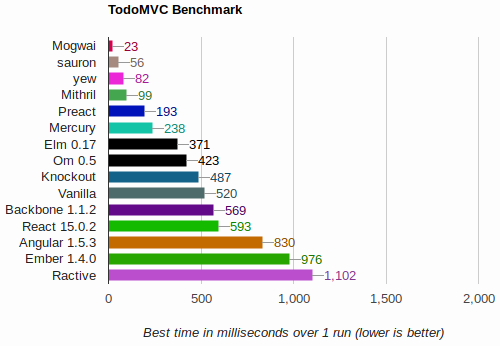

<div align="center">
  <h1>
    <a href="https://bomtoons.newgrounds.com/" target="_blank" title="art by bomtoons at newgrounds">
      
    </a>
    <br />
    mogwai
  </h1>
</div>


> **m**inimalist, **o**bvious, **g**raphical **w**eb **a**pplication **i**nterface


release: [![Crates.io][ci]][cl] 

master: 

[ci]: https://img.shields.io/crates/v/mogwai.svg
[cl]: https://crates.io/crates/mogwai/


`mogwai` is a frontend DOM library for creating web applications.
It is written in Rust and runs in your browser and has enough functionality server-side
to do rendering. It is an alternative to React, Backbone, Ember, Elm, Purescript, etc.

## goals

* provide a declarative approach to creating and managing DOM nodes
* encapsulate component state and compose components easily
* explicate DOM updates
* be small and fast (snappy af)

If mogwai achieves these goals, which I think it does, then maintaining
application state, composing widgets and reasoning about your program will be
easy. Furthermore, your users will be happy because their UI is snappy!

## concepts
The main concepts behind `mogwai` are

* **channels instead of callbacks** - view events like clicks, blurs, etc are transmitted
  into a channel instead of invoking a callback. Receiving ends of channels can be branched
  and may have their output messages be mapped, filtered and folded. `mogwai`'s channels are
  many-producer, many-consumer and are immediate - they do not perform buffering and do not
  require polling.

* **views are dumb** - a `View` is just a bit of DOM that receives and transmits messages.
  When a `View` goes out of scope and is dropped in Rust, it is also dropped from the DOM.
  `Views` may be constructed and nested using plain Rust functions or an RSX macro.

* **widgets are folds over input messages** - a `Gizmo` is `mogwai`'s controller. `Gizmo`s
  maintain state and communicate messages to views. The `Gizmo`'s update function is a fold
  over messages sent on its `Transmitter` that mutate the state variable and send output
  messages to the `View`, which in turn update the DOM.

* **communication is easy** - just `gizmo.send(&my_message)` to send a message into a gizmo
  and the gizmo will update its view accordingly.

## example
Here is an example of a "dumb view" button that counts its own clicks.

```rust
extern crate mogwai;
use mogwai::prelude::*;

let (tx, rx) =
  txrx_fold(
    0,
    |n:&mut i32, _:&Event| -> String {
      *n += 1;
      if *n == 1 {
        "Clicked 1 time".to_string()
      } else {
        format!("Clicked {} times", *n)
      }
    }
  );

let view = view!(
    <button on:click=tx>
        {("Clicked 0 times", rx)}
    </button>
);

if cfg!(target_arch = "wasm32") {
  view.run().unwrap_throw()
}
```

Here's that same example using the elm-like `Component` trait:

```rust
use mogwai::prelude::*;

pub struct Button {
    pub clicks: i32
}

#[derive(Clone)]
pub enum ButtonIn {
    Click
}

#[derive(Clone)]
pub enum ButtonOut {
    Clicks(String)
}

impl Component for Button {
    type ModelMsg = ButtonIn;
    type ViewMsg = ButtonOut;
    type DomNode = HtmlElement;

    fn update(
        &mut self,
        msg: &ButtonIn,
        tx_view: &Transmitter<ButtonOut>,
        _subscriber: &Subscriber<ButtonIn>
    ) {
        match msg {
            ButtonIn::Click => {
                self.clicks += 1;
                let text = if self.clicks == 1 {
                    "Clicked 1 time".to_string()
                } else {
                    format!("Clicked {} times", self.clicks)
                };
                tx_view.send(&ButtonOut::Clicks(text))
            }
        }
    }

    // Notice that the `Component::view` function returns a `ViewBuilder<T>` and not
    // a `View<T`.
    fn view(
        &self,
        tx: &Transmitter<ButtonIn>,
        rx: &Receiver<ButtonOut>
    ) -> ViewBuilder<HtmlElement> {
        let tx_event = tx.contra_map(|_:&Event| ButtonIn::Click);
        let rx_text = rx.branch_map(|ButtonOut::Clicks(text)| text.clone());

        builder!(
            <button on:click=tx_event>
                {("Clicked 0 times", rx_text)}
            </button>
        )
    }
}

let gizmo = Gizmo::from(Button{ clicks: 0 });
let view = View::from(gizmo.view_builder());
// Queue some messages for the component, as if the button had been clicked:
gizmo.send(&ButtonIn::Click);
gizmo.send(&ButtonIn::Click);

assert_eq!(&view.html_string(), "<button>Clicked 2 times</button>");

if cfg!(target_arch = "wasm32") {
    // running a view adds its DOM to document.body and ownership is passed to the window
    // this only works in the browser
    view.run().unwrap_throw()
}

// After handing off the view the gizmo itself may fall out of scope and be dropped. The
// view is all that is needed for your app to run.
```

## introduction
If you're interested in learning more - please read the [introduction and
documentation](https://docs.rs/mogwai/).

## why
Rust is beginning to have a good number of frontend libraries. Most however,
encorporate a virtual DOM with a magical update phase. Even in a languague that
has performance to spare this step can cause unwanted slowness.

`mogwai` lives in a happy space just above "bare metal". It does this by
providing the tools needed to declare exactly which parts of the DOM change and
when. These same tools encourage functional progamming patterns like encapsulation over
inheritance.

Channel-like primitives and a declarative view are used to define
components and then wire them together. Once the interface is defined and built,
the channels are effectively erased and it's functions all the way down. There's
no performance overhead from vdom, shadow dom, polling or patching. So if you
prefer a functional style of programming with lots of maps and folds - or if
you're looking to go _vroom!_ then maybe `mogwai` is right for you and your
team :)

Please do keep in mind that `mogwai` is still in alpha and the API is actively
changing.

### made for rustaceans, by a rustacean
Another benefit of `mogwai` is that it is Rust-first. There is no requirement
that you have `npm` or `node`. Getting your project up and running without
writing any javascript is easy enough.

### performance
`mogwai` is snappy! Here is some very handwavey and sketchy todomvc benchmarketing:



## ok - where do i start?
First you'll need new(ish) version of the rust toolchain. For that you can visit
https://rustup.rs/ and follow the installation instructions.

Then you'll need [wasm-pack](https://rustwasm.github.io/wasm-pack/installer/).

For starting a new mogwai project we'll use the wonderful `cargo-generate`, which
can be installed using `cargo install cargo-generate`.

Then run
```shell
cargo generate --git https://github.com/schell/mogwai-template.git
```
and give the command line a project name. Then `cd` into your sparkling new
project and
```shell
wasm-pack build --target web
```
Then, if you don't already have it, `cargo install basic-http-server` or use your
favorite alternative to serve your app:
```shell
basic-http-server -a 127.0.0.1:8888
```
Happy hacking! :coffee: :coffee: :coffee:

## more examples please
For more examples, check out

[the sandbox](https://github.com/schell/mogwai/blob/master/examples/sandbox/)

[the todomvc app](https://github.com/schell/mogwai/blob/master/examples/todomvc)

[the benchmark suite](https://github.com/schell/todo-mvc-bench/)

To build the examples use:
```shell
cd examples/whatever && wasm-pack build --target web
```

## support channel :phone:
There is an experimental realtime support channel at https://matrix.to/#/!iABugogSTxJNzlrcMW:matrix.org?via=matrix.org. 
YMMV

## sponsorship
Please consider sponsoring the development of this library!

* [sponsor me on github](https://github.com/sponsors/schell/)
